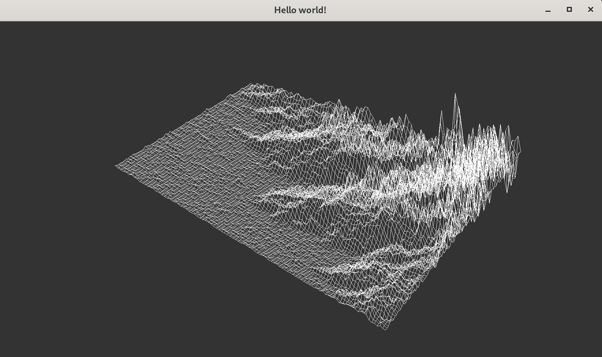

# 🌐 FdF (Fil de Fer) - 3D Wireframe Visualizer

> "Simplicity is the ultimate sophistication."

[](https://en.wikipedia.org/wiki/C_(programming_language))
[](https://github.com/42Paris/minilibx-linux)
[](https://42.fr/)

## 🏔️ Introduction

FdF is a graphical algorithm project. The goal is to represent a topographic map (a mesh of points with X, Y, Z coordinates) in a 2D window, creating a "wireframe" representation using pure isometric projection.

This project focuses on **rendering precision** and the manual implementation of line-drawing algorithms, avoiding the use of external visual aids or high-level graphics engines.

---

## 📸 Result


*(Map rendering in strict isometric projection)*

---

## ⚙️ Engineering Behind the Pixel

Since no high-level graphics libraries (like OpenGL) are used, all drawing logic is written entirely in C:

1.  **Reading and Parsing:** Conversion of text maps (`.fdf`) into memory data structures, handling coordinates and dynamic memory allocation.
2.  **Isometric Projection:** Mathematical transformation of each `(x, y, z)` point from 3D space to a 2D plane `(x, y)` to simulate depth.
3.  **Bresenham's Algorithm:** Implementation of the classic algorithm to draw perfect straight lines between two points on a pixel grid, optimizing CPU usage (using integer arithmetic instead of floating-point where possible).

---

## 🛠️ Installation & Usage

This project requires basic system libraries (MinilibX requires X11 on Linux).

```bash
# 1. Clone the repository
git clone [https://github.com/grabier/FdF.git](https://github.com/grabier/FdF.git)

# 2. Enter the directory and compile
cd FdF && make

# 3. Run with a map
./fdf test_maps/42.fdf
